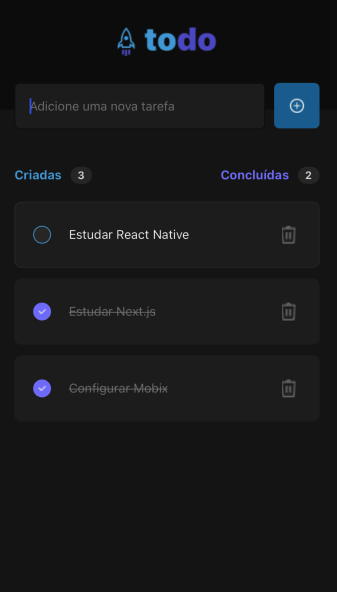

# To Do App - Rocketseat

<p align="center" width="100%">
   
</p>

A toDo app created in React Native. This project was created as a learning path to React Native newest technology.

## Installation

You will need to install the dependencies to install and work with this project, you can follow the [React Native configuration doc](https://reactnative.dev/docs/environment-setup#installing-dependencies).
After the installation, you will need to run the commands at the bottom

```bash
npm install
expor run
```

## Screens

<p align="center" width="100%">
    
</p>

## Contributing

Pull requests are welcome. For major changes, please open an issue first
to discuss what you would like to change.

Please make sure to update tests as appropriate.

## License

[MIT](https://choosealicense.com/licenses/mit/)
